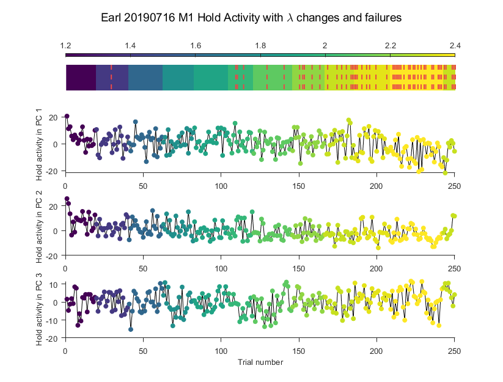
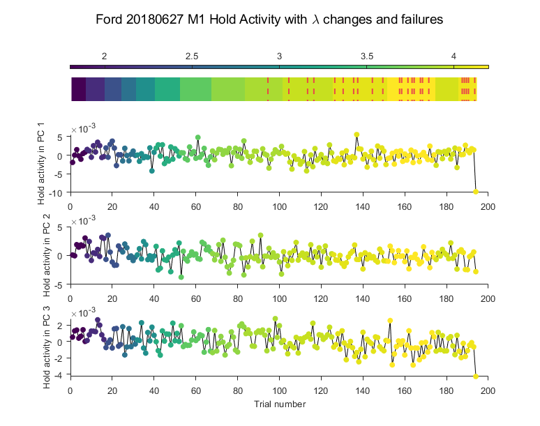
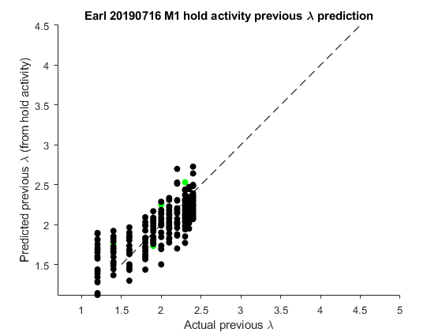
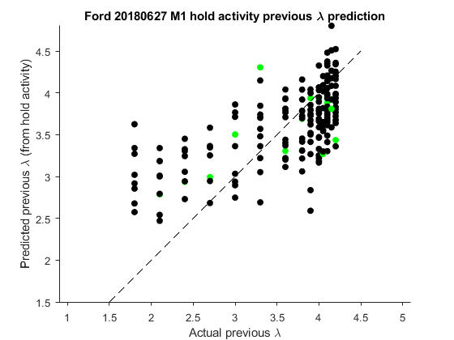
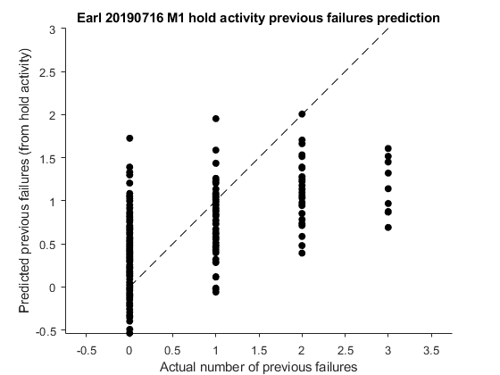
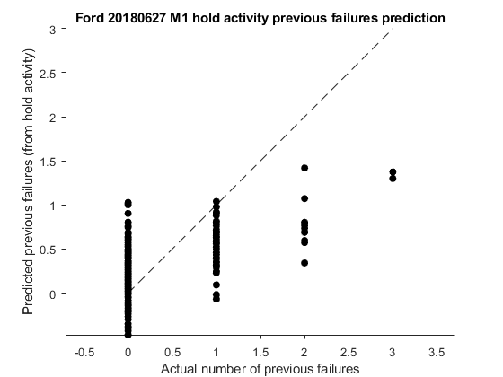

:question: Is there a dimension of neural activity corresponding to neural engagement? Perhaps something that corresponds to whether $\lambda$ changed on the last trial, or whether there have been previous failures?

In [Hennig et al. 2021](https://doi.org/10.1038/s41593-021-00822-8), they found a neural dimension corresponding to engagement with the BCI task. When there were changes in the task (e.g. the decoder changes), activity along this axis increases and then slowly decreases over a series of trials.

They found this axis separately for each target direction during a BCI center-out task--they defined it as the dimension along which neural activity had the most variance for trials to that specific target. This also happened to line up nicely with the "ones" axis, the axis along which most, if not all, neural loadings were positive and similar to each other.

Aaron has a vague memory of a previous master's student finding some kind of change in neural activity after $\lambda$ changed in CST--might there be a neural engagement signal in this task too?

Since we don't really have targets in CST, our next best bet was to look at the activity during the hold period--perhaps there would be some large variance dimensions of neural activity that could correspond to whether the $\lambda$ changed within the last couple trials, or the number of previous failures in the task. Below are figures plotting the first three PCs of average hold time activity during CST (note: neural activity was softnormed here)

In these figures, top plot shows the $\lambda$ for each trial as a color (where the actual value is given by the color bar at the top... it's a little confusing). The red dashed lines indicate trials on which the monkey failed the task. Other three plots show average hold time activity in PC 1, 2, or 3, where each dot represents one trial, colored by its $\lambda$. For Earl, there seems to be a slow drift in PC1 , possibly related to lambda changes or failures, but it could also be related to disinterest in the task--hard to say without randomized $\lambda$. Other than that, I can't really see a correspondence between hold time activity and $\lambda$ changes or failures.

One way to check this out a bit more is to try to predict either the $\lambda$ on the previous trial or the number of previous failures from the hold time activity. Figures below:

Again, slight correlation in Earl with $\lambda$ on previous trial, but this might be due to the slow drift.

No real correlation here unfortunately.

One possible followup for this engagement work is just to look at the mean firing rate across neurons for each trial to see if there's anything that jumps out--since the engagement axis in the Hennig paper was mainly in the "ones" axis, maybe a straight average across normed neurons will pull something from the noise.

If we try to look for engagement in neural population during the movement phase of CST, one thing we might have to contend with is the monkey's arm movements (which weren't present in the BCI task in the Hennig paper), but perhaps we can just fit a linear model between neural activity and arm movement and then just look at the null space of that to take out the majority of arm-related neural signals.
