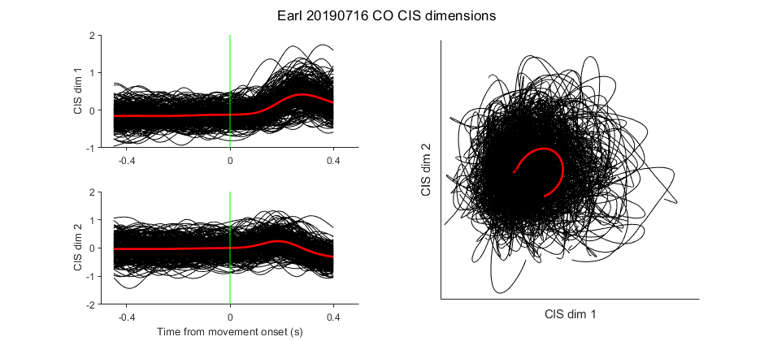
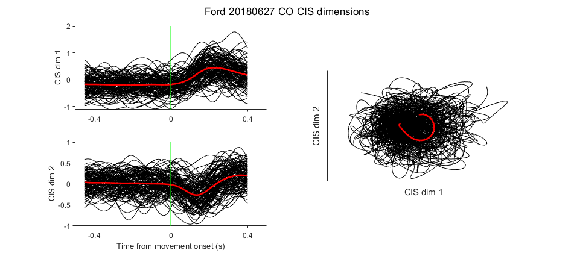

:question: Is there a neural "go" signal underlying intermittent movements/control?

One result out of the literature recently has been that there are condition-independent signals (CIS) in neural activity that don't relate to the exact movement being performed, but rather as a signal of whether a movement is being performed at all (see [Kaufman et al. 2016](https://doi.org/10.1523/eneuro.0085-16.2016), [Rouse et al. 2018](https://doi.org/10.1101/453746), [Zimnik and Churchland 2021](https://doi.org/10.1038/s41593-021-00798-5)). The signal seems like a kind of neural "go" signal--it's one thing we might be able to look for in CST as a marker of corrective or intermittent movements.

First, though, we need to see if we can find the CIS in CO on a single trial level--most, if not all previous work with the CIS has been using trial-averaged data, and since we can't readily do that with CST, we'd like to be able to find the CIS in single CO trials.

The results are unfortunately mostly negative--though the CIS dimensions are clearly there in a trial average, it's very difficult to see on single trials (see figures below).

So if we want to pull out a CIS from CST trials, we'll need to find a way to average across movements. Perhaps we could take the first 500ms of each CST trial, or we could run some submovement decomposition to pull out hold and move states.
