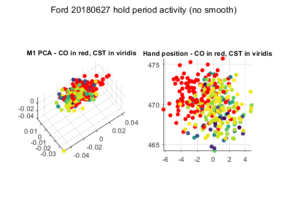

# 2021/12/10 Hold time neural analysis

- :question: Are there dimensions of neural activity that separate CO and CST?
    - :heavy_check_mark: Hold time analysis says possibly in the very early part of the movement, but perhaps this is due to kinematic differences?

Gallego et al. 2018 showed that M1 neural activity underlying multiple tasks shared some dimensions of neural activity, but also that there were certain dimensions of activity that separated different tasks. Though the tasks differed in the impedance of wrist movement (ranging from isometric to freely moving), the tasks were quite comparable: they were all wrist-based tasks with similar trial structure, where the monkey moved a cursor to visually presented targets within a set amount of time.

If we want to compare CO and CST in the same way, our best bet to start with is to compare neural activity during the hold period, when the instructions and hand kinematics are roughly the same between tasks. Simply plotting the hold time neural activity in the top PCs initially showed that there was a great separability between CO and CST hold-time neural state, despite there not being as much difference in the hand position during the hold time (figures below).

In both figures, each dot represents the average activity or hand position in one trial, with CO trials in red and CST trials in viridis (blue-green-yellow), with blue corresponding to low lambdas and yellow corresponding to high lambdas.

This separation was impressive, but I realized that I had mistakenly smoothed the neural activity with a 50ms wide Gaussian kernel before trimming and averaging the data. Because the kernel is non-causal, there was potentially some leakage from the initial movement phase into the apparent hold time activity. Removing the smoothing seemingly removes the easy-to-see separation in the neural space:

This is disappointing, but we should note two things:

1) There's significant overlap in the first few PCs of neural activity, but that doesn't preclude the existence of a task context dimension of neural activity in a lower variance dimension.
2) The fact that such a small change (a 50 ms smoothing kernel) can induce such a large separation in neural activity suggests that even if there's no separation during the hold time, the neural activity separates remarkably quickly after the trial starts. We still need to investigate whether this separation is simply due to a difference in initial kinematics, but it's possible that the early part of the trial is where the neural activity separates based on context.

So there are still avenues to pursue to extract a task context dimension of neural activity. Perhaps there's even a separation between $\lambdas$ in the initial period of the trial.