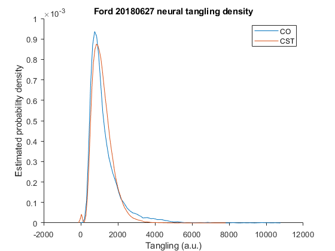
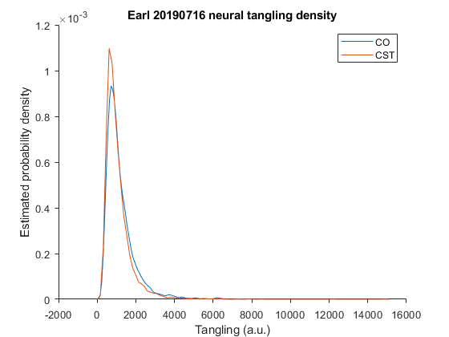
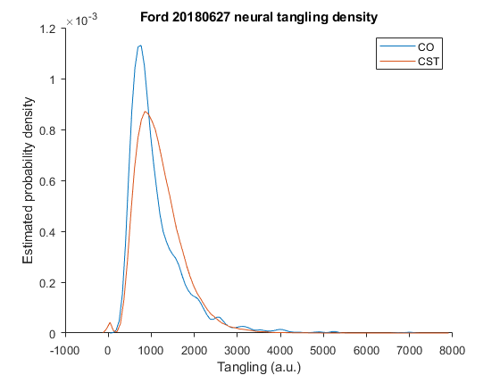
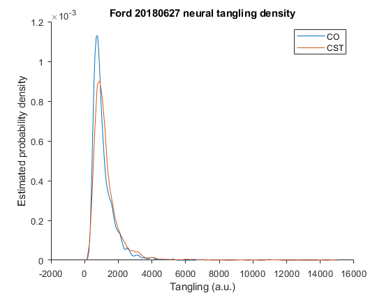
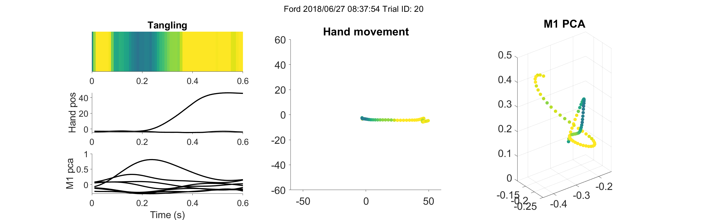
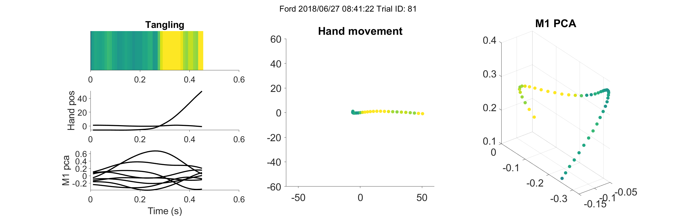
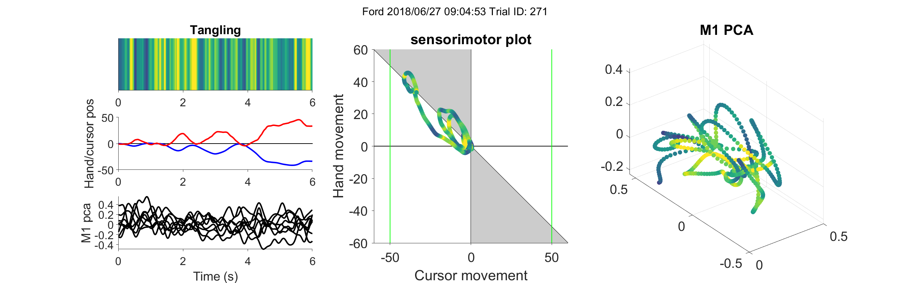
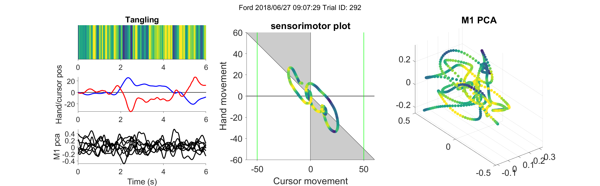

# 2021/12/13 Tangling analysis

## Overall task tangling

- :question: CST is much more feedback driven than CO. Does this show up as M1 dynamics being less apparently autonomous? That is, is neural tangling higher in CST than CO?
    - :heavy_check_mark: Tangling doesn't really appear to be much higher in CST than CO, suggesting that the feedback may be "predictable" most of the time. 
    - :speech_balloon: Does tangling depend on the amount of data you use to check it? Right now I'm thinking it probably does, but I can't be sure without simulation

In Russo et al. 2018, they found that M1 exhibited low "tangling". This metric basically measures how predictable the dynamics of neural activity are--if you're in one neural state, low tangling would indicate that the neural state on the next time point is highly consistent. On the other hand, high tangling at a particular time point indicates that the next neural state is somewhat unpredictable--basically the neural trajectories that travel through or near that neural state are "tangled". A purely autonomous neural dynamical system should exhibit low tangling (assuming we have a complete or near complete view of the neural state space)--thus, high tangling should indicate that a system's dynamics are non-autonomous, either through time-varying dynamics, or more likely, via inputs to the system. 

As a reminder, tangling is defined as

$$ Q(t) = \underset{\tau}\max( \dfrac {\dot{x}_{\tau} - \dot{x}_{t}} {x_{\tau}-x_t} ) $$

where $x_{t}$ corresponds to the neural state at timepoint $t$ and $\dot{x}_t$ corresponds to the time derivative of the neural state at time $t$. Tangling ($Q(t)$) is thus maximal when two neural states are close together, but their time derivatives are quite different.

Because CST is more feedback-driven than CO, you would expect that M1 neural dynamics shouldn't be as autonomous-like in CST as we know it is in CO. This could mean that we should expect higher tangling in CST than CO. To check this, we ran an analysis of neural tangling in the 8 dimensions of neural activity that explain the most variance for both CO and CST. In both cases, we smoothed the neural activity using a Gaussian kernel with standard deviation of 75 ms and soft normalized it (with $\alpha=5$). The time periods in which we checked tangling was between the go cue time and the end of each trial.

Plotting an estimated probability density of tangling values for each task shows that there's a great deal of overlap in tangling distributions, which seems quite unexpected, given how feedback driven CST is. One possibility is that including the whole trial during the CO task includes more than just the ballistic, feedforward part of the movement. In the time right after go cue, there are likely some inputs to M1 telling it which target to prepare and execute a movement for. Likewise, near the end of a CO movement, a monkey will often adjust the trajectory of the hand based on errors in the reach. Thus one modification may be to limit the CO tangling analysis to the middle portion of the trial, after movement onset and before any possible corrections.

From this reduction in CO trial time, there is slightly more difference between the two task distributions, though they still overlap significantly.

Another possible consideration is that we search for highly tangled pairs of states in a much larger set of timepoints with CST, given that CST has 6 second trials and there are many more of them. This may artificially inflate tangling, especially in the presence of noisy neural state. We can test this by limiting the CST trials to one specific $\lambda$ (in the following figure, $\lambda = 3.3$, still taking only the middle part of the CO trials)

Once again, the distributions are highly overlapping. We'll probably have to be careful about the amount of data we use to compute tangling going forward, or we will need to find a good way to trial average data across the CST dataset (possibly through a submovement decomposition?).

The fact that tangling is similar between CO and CST is quite interesting. It suggests that while CST is quite feedback-driven, the dynamics of M1 remain mostly predictable. This predictability may stem from the fact that as a whole, the monkey-CST system has predictable dynamics, apart from sensory and motor noise at the interface between the monkey and the computer. Another possibility is that M1 remains untangled *most* of the time, but gets tangled at times when it integrates feedback to make a motor adjustment.

## Timecourse of tangling

- :question: Does the timecourse of tangling over a CST or CO trial reveal anything about corrective movements? Perhaps tangling increases before corrective movements or after apparent errors to signify introduction of unexpected feedback.
    - :speech_balloon: May need to develop corrective movement detection to enable trial averaging, as well as apparent error detection (for CST, this might equate to moving the hand in the wrong direction)

If tangling is generally low in M1 because the monkey is intermittently integrating feedback information, then it may be possible to see this by looking at the timecourse of tangling through CO and CST trials.

Below is a representation of an example CO trial.

In this figure, the left column shows the timecourse of tangling (top, yellow is highest tangling), hand kinematics, and the 8 dimensions of M1 neural state. Middle column shows the hand movement in the x-y plane, with points colored by tangling (same color map as top left). Right plot shows the top three dimensions of M1 activity, colored by tangling.

One highly noticable aspect of this trial is the late correction that the monkey makes to stay in the final target--this correction is surrounded by a period of high tangling, as we might expect. However, not all CO trials are this readily interpretable. For example, here is a trial in which tangling appears to be high during the main movement.

Moving onto CST trials, interpretation is (as always) a little bit trickier. Below are representations of a few CST trials.

This representation of the trial is the same as the CO plots, with the exception that the middle plot is replaced by a sensorimotor plot, showing the hand position plotted against cursor position, highlighting the when the two are and are not in direct opposition.

It's hard to say anything for sure from these plots, but it does seem like larger movements in general have lower tangling. This might be due to the neural state reaching out from the tangled ball in the center (right plot), but it's not entirely clear. We maybe have to come up with some submovement decomposition over which to average neural traces before we can interpret tangling in this task.

Find more figs/trials folder.
